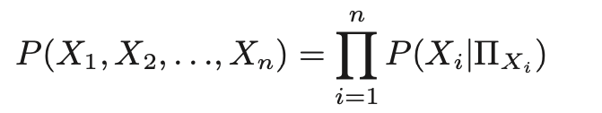

# Structure
- Intro
- Related Work
- Our Approach
- Experiments
- Results and Discussion
- Conclusion

# Abstract
- Topic: Robot Execution Failures Explanation
- Problems:
  1. data collection
  2. cause-effet model learniing
  3. causal explanations generation
- Approach:
  1. Simulatino data
  2. casal bayesian network
  3. contrastive explanations, comparing the closest successful state, found through breadth-first search, predictions from the learned causal model.
  4. Experiments: 
     1. Stacking cubes
     2. dropping spheres into a container
     3. Results

# Introduction
why need explainability? -> what kind of explanation should we have? -> how to get? -> causality: statistical methods learn the possibility mapping causes to the action-outcome. -> turn possibility to explanations. -> to address the problems above. -> their work in this paper(see pic) -> experments in two different scenarios.

# Related Work
- Causality in Robotics
  - the causality between actions -> the causality between different features and action outcome
- Learning Explainable Models of Cause-Effect Relations
  - simmulated environment(human virtual demonstration) & learn symbolic preconditions of a task and a function approximation for success execution -> model the probability of various features mapping to success & compare the difference of variables in failure and success -> generate an explanation
- Contrastive Explanations

# Approach to Explaining Failures
- Steps:
  - Idenfify the variables related in the task
  - structure learning: a graphical representation of the variable relations
  - parameter learning: conditional probability distributions
  - contrastive explanation generation
- Variables Definition
  - C(action vars), E(effect vars)
  - randomly sample C before simulation data collection, measure E after that, and then collect data sample X = (c1, c2, ..., ct, e1, e2, ..., en)
  - robot has no knowledge about one variable belongs to C or E, it should be learned by the Bayesian model
  - Xgoal = successful data samples.
- Pipeline to Learn the causal Model -> conditional probability
  - Struture Learning - Grow Shrink: use statistical tests to learn conditional independence relations
  - Parameter Learning: fit the right side(factorization in formula based on the observation of left side)

- Method to Explain Failures
  - every single-variable change for all possible variable parametrizations as children
  - BFS, searches for the closest variable parametrization whose successful possibility higher than a given threshold
  - generate contrastive explanations that compare the current failed variable parametrization with the closest successful parametrization