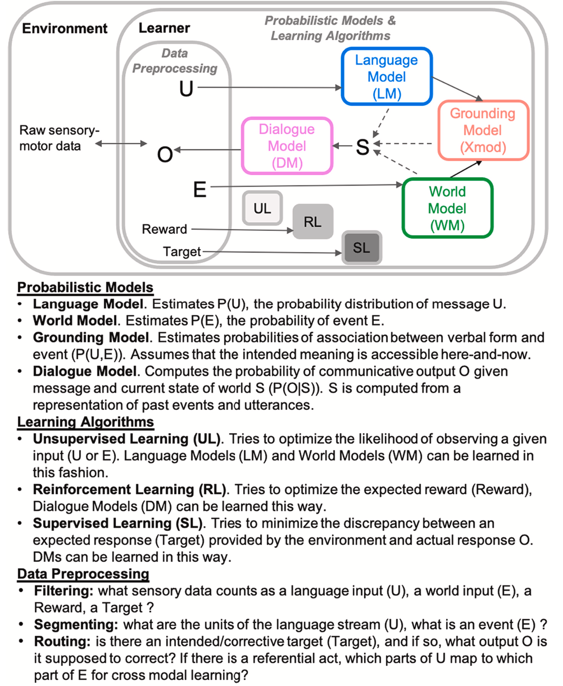

# Structure
- Abstract
- Introduction
- Three types of information relevant for language acquisition
- A socio-computational architecture for the language learner
- Integrating multiple sources of language information within
SCALa
- Roadmap
- Conclusion

# Abstract
- What problem do they focus on?
  - computational models of the early language learner(SCALa) connecting language acquisition information and computational mechanisms

# Introduction
- what's their objective?
  - intergrate all learning process using computational approach
  - two approaches to understand early language learning: experimental laboratory studies and corpus studies
  - investigate how infants learn language from their interactions with others
  - correlation of environmental input and language acquisition: does the acquisition of syntax depend primarily on observing the distribution of linguistic patterns in the input, on the correlation of input and the world, or on corrective feedback? Is it the same for phonetics and semantics? What happens if one of these sources is reduced or degraded?

# Three types of information relevant for language acquisition
- Language as Structure
  - native language's structural aspects, ranging from phonetic categories to syntax
- Language as a description of the world
  - infants need to learn not only about the structure of language, but also about how the content of language connects to the outside world, involving both visible and invisible states as well as concrete and abstract concepts.
- Language as a social construct
  - how to use language in social interactions.
  - the infant learns language at the same time as she learns her place in social interactions

# Socio-Computational Architecture of Language Acquisition (SCALa)
- two sets of components:
  - probabilistic models and learning algorithms
  - data preprocessing components

